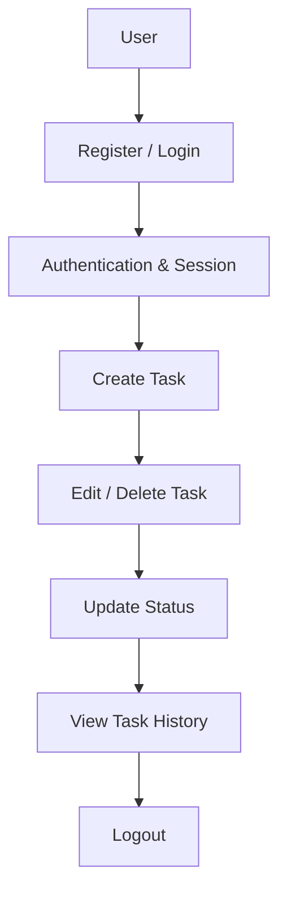
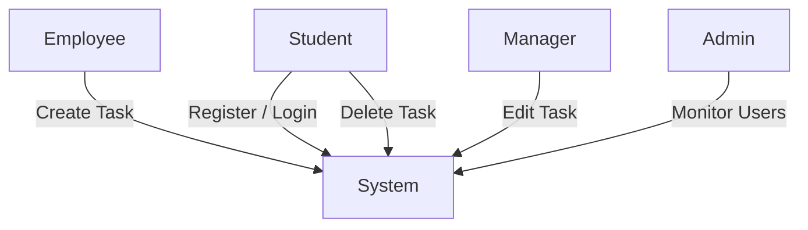
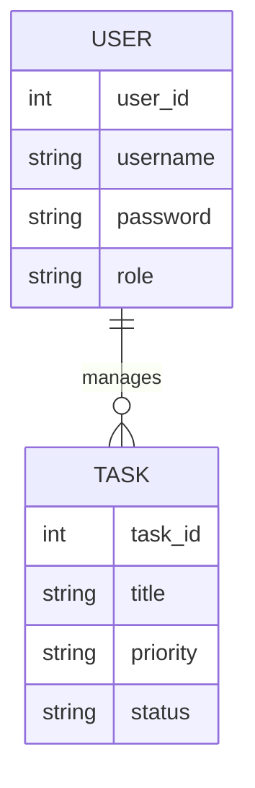

 markdown
# To-do-list
## Diagrams

# To-do-List
## Diagrams
 main
### 1. System Flow Diagram

### 2. Use Case Diagram

### 3. ER Diagram

1. Purpose
It is to help users manage their daily tasks efficiently.
The system allows users to create, update, and track tasks so that they can organize their work and improve productivity.

2. Users
The users of the system include:
•	Employees
•	Managers
•	Admin
3. Scope
•	Creating and managing daily tasks
•	Updating task status 
•	Viewing task lists based on priority
•	Secure user login and task management
•	Admin monitoring user activity
4. Functional Requirements
•	User registration and login
•	User authentication using username and password
•	Create new tasks
•	Edit existing tasks
•	Delete tasks
•	Mark tasks as completed
•	View task history
5. Technical and Backend Technology
•	Programming Language: Python
•	Framework: Flask
•	Database:MySQL
6. Frontend Technology
•	HTML
•	CSS
 markdown

 main
